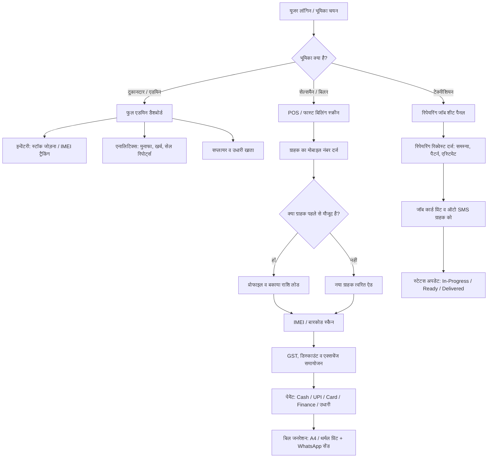

# 'श्री साई मोबाइल शॉप' (Shree Sai Mobile Shop)
## सॉफ्टवेयर रिक्वायरमेंट स्पेसिफिकेशन (SRS) एवं सिस्टम आर्किटेक्चर डॉक्यूमेंट

---

### 1. प्रोजेक्ट का संक्षिप्त परिचय (Project Overview)
**प्रोजेक्ट का नाम:** Shree Sai Mobile Shop Management System  
**प्रकार:** क्लाउड-बेस्ड वेब एप्लिकेशन / ERP & POS (Point of Sale)  
**लक्ष्य:** मोबाइल और एक्सेसरीज रिटेल शॉप के पूरे दैनिक संचालन (Daily Operations) को डिजिटल, तेज़, पारदर्शी और त्रुटि-मुक्त (Error-Free) बनाना।

एक साधारण किराना या कपड़े की दुकान की तुलना में **मोबाइल शॉप का बिजनेस काफी अलग और संवेदनशील होता है**, क्योंकि:
1. हर फोन का एक यूनिक **IMEI नंबर (15 डिजिट)** होता है (वारंटी और पुलिस वेरिफिकेशन के लिए जरूरी)।
2. फोन के साथ-साथ एक्सेसरीज (कवर, चार्जर, ईयरफोन) का बल्क स्टॉक होता है।
3. पुराने फोन का एक्सचेंज (Second Hand Phone Purchase/Sale) होता है।
4. रिपेयरिंग/सर्विसिंग (स्क्रीन रिप्लेसमेंट, कॉम्बो, चार्जिंग पिन) का काम होता है।
5. मार्केट में उधारी (क्रेडिट खाता) और अलग-अलग पेमेंट मोड्स (UPI, Cash, EMI/Finance) चलते हैं।

यह सिस्टम इन सभी जरूरतों को एक ही डैशबोर्ड से मैनेज करने के लिए तैयार किया जाएगा।

---

### 2. अनुशंसित टेक स्टैक (Recommended Tech Stack)

| लेयर | टेक्नोलॉजी | चयन का कारण |
| :--- | :--- | :--- |
| **Frontend** | **Next.js 14+ (App Router) + React** | सुपर-फास्ट लोडिंग, SEO-फ्रेंडली और बेहतरीन डेवलपर एक्सपीरियंस। |
| **Styling & UI** | **Tailwind CSS + Shadcn UI + Lucide Icons** | साफ-सुथरा, मॉडर्न, डार्क/लाइट मोड और मोबाइल/टैबलेट पर 100% रिस्पॉन्सिव। |
| **Backend / API** | **Next.js Server Actions / API Routes** (या Node.js + Express) | आसान स्केलिंग और एक ही कोडबेस में फुल-स्टैक डेवलपमेंट। |
| **Database** | **PostgreSQL (with Prisma ORM)** | वित्तीय लेनदेन और इन्वेंटरी के लिए रिलेशनल डेटाबेस (ACID Compliant) सबसे सुरक्षित होता है। |
| **State & Cache** | **Zustand / TanStack React Query** | ऑफलाइन-फर्स्ट स्पीड, फास्ट बिलिंग कार्ट और आसान स्टेट सिंकिंग। |
| **इनवॉइस और प्रिंटिंग** | **@react-pdf/renderer + Browser Print API** | A4 लेजर प्रिंट और 80mm / 58mm थर्मल रसीद प्रिंटर सपोर्ट। |
| **स्कैनर सपोर्ट** | **HID Barcode/QR/IMEI Scanner Listener** | किसी भी USB या ब्लूटूथ बारकोड स्कैनर को डायरेक्ट सपोर्ट। |
| **थर्ड-पार्टी सेवाएं** | **WhatsApp Cloud API, SMS Gateway, Cloudinary** | डिजिटल बिलिंग, रिपेयरिंग अपडेट्स और कस्टमर KYC डॉक्यूमेंट्स के लिए। |

---

### 3. विस्तृत सिस्टम फ्लो (End-to-End System Flow)



---

### 4. आवश्यक फीचर्स की विस्तृत लिस्ट (Module-Wise Feature Breakdown)

#### मॉड्यूल 1: ऑथेंटिकेशन एवं यूजर रोल्स (Authentication & Roles)
1. **मल्टी-रोल सपोर्ट:**
   - **Super Admin / Owner:** सभी रिपोर्ट्स, मुनाफा, खरीद मूल्य, स्टॉक डिलीट और स्टाफ मैनेजमेंट देखने का पूरा अधिकार।
   - **Salesperson / Cashier:** केवल बिलिंग, स्टॉक सर्च (केवल सेलिंग प्राइस) और ग्राहक जोड़ने का अधिकार। खरीद भाव और शुद्ध मुनाफा छिपा रहेगा।
   - **Technician / Repair Staff:** केवल रिपेयरिंग रिक्वेस्ट देखने, स्टेटस अपडेट करने और पार्ट्स कंजम्पशन मार्क करने का अधिकार।
2. **सुरक्षा:** JWT बेस्ड ऑथेंटिकेशन, ऑटोमैटिक सेशन टाइमआउट, और गतिविधि लॉग्स (Activity Audit Logs)।

---

#### मॉड्यूल 2: इन्वेंटरी एवं स्टॉक मैनेजमेंट (Inventory & IMEI Tracking)
*यह मोबाइल शॉप सॉफ्टवेयर का सबसे महत्वपूर्ण हिस्सा है।*

1. **यूनिक IMEI ट्रैकिंग:**
   - जब भी कोई नया फोन स्टॉक में आए, उसका **IMEI 1 और IMEI 2** बारकोड स्कैनर से तुरंत स्कैन होगा।
   - सिस्टम में दो समान IMEI कभी दर्ज नहीं हो सकेंगे (Duplicate IMEI Prevention)।
   - किसी भी समय एक क्लिक पर पता चल सकेगा कि फलां IMEI कब खरीदा गया, किस सप्लायर से आया, किस ग्राहक को बिका, और उसकी वारंटी कब तक है।
2. **कैटेगरी एवं वेरिएन्ट्स:**
   - **मोबाइल फोन्स:** ब्रांड (Apple, Samsung, Vivo, etc.), मॉडल (e.g. S24, V30), कलर, रैम/स्टोरेज (e.g. 8GB/128GB)।
   - **एक्सेसरीज:** टेम्पर्ड ग्लास, बैक कवर, चार्जर, केबल, ईयरबड्स (इनके लिए क्वांटिटी-बेस्ड स्टॉक व बारकोड)।
   - **स्पेयर पार्ट्स:** डिस्प्ले/कॉम्बो, बैटरी, कैमरा लेंस, चार्जिंग पत्ता (रिपेयरिंग के लिए)।
3. **कम स्टॉक अलर्ट (Low Stock Notifications):**
   - जब भी कोई मॉडल या एक्सेसरी तय न्यूनतम सीमा (e.g. 2 पीस) से कम हो, डैशबोर्ड पर लाल चेतावनी दिखेगी।
4. **डेड स्टॉक और एजिंग रिपोर्ट:**
   - कौन सा फोन 60 या 90 दिनों से दुकान में बिना बिके पड़ा है, ताकि उसे समय रहते डिस्काउंट या ऑफर में निकाला जा सके।

---

#### मॉड्यूल 3: पॉइंट ऑफ सेल (POS) एवं फास्ट बिलिंग (POS & Billing Engine)
1. **हाई-स्पीड बिलिंग (10 सेकंड के अंदर बिल):**
   - सिर्फ फोन का IMEI बारकोड स्कैन करते ही मॉडल, स्पेसिफिकेशन और प्राइस अपने आप कार्ट में आ जाएगा।
2. **GST और नॉन-GST बिलिंग:**
   - GST इनवॉइस (B2B और B2C): 18% GST (या लागू दर), HSN कोड ऑटोमैटिक प्रिंट।
   - नॉन-GST / रेगुलर रिटेल रसीद (छोटे ग्राहकों या एक्सेसरीज के लिए विकल्प)।
3. **ओल्ड फोन एक्सचेंज (Old Phone Buyback):**
   - अगर ग्राहक नया फोन लेते समय पुराना फोन एक्सचेंज करता है:
     - पुराने फोन का IMEI, मॉडल, कंडीशन और वैल्यू दर्ज होगी।
     - एक्सचेंज वैल्यू नए बिल में से माइनस हो जाएगी।
     - कानूनी सुरक्षा के लिए ग्राहक का आधार/आईडी कार्ड और अंडरटेकिंग फॉर्म सिस्टम में सेव होगा।
4. **मल्टीपल पेमेंट गेटवे और स्प्लिट पेमेंट:**
   - उदाहरण: ₹20,000 के फोन के लिए ₹10,000 Cash + ₹5,000 PhonePe/UPI + ₹5,000 उधारी या बजाज/टीवीएस फाइनेंस।
5. **प्रिंटिंग और डिजिटल शेयरिंग:**
   - 80mm / 58mm थर्मल रसीद प्रिंटर (Thermal POS) पर प्रिंट।
   - मानक A4 / A5 लेजर बिल प्रिंट।
   - **WhatsApp ऑटो-सेंड:** ग्राहक के WhatsApp नंबर पर PDF इनवॉइस का लिंक तुरंत भेजना।

---

#### मॉड्यूल 4: ग्राहक और उधारी खाता प्रबंधन (CRM & Credit Ledger)
1. **ग्राहक प्रोफाइल:** नाम, मोबाइल नंबर, पता, GSTIN (यदि B2B है), और अब तक की कुल खरीदारी।
2. **उधारी / खाता वही (Khata Book):**
   - पेंडिंग बैलेंस, पिछले भुगतान का इतिहास।
   - **पेमेंट रिमाइंडर (SMS / WhatsApp Reminder):** "प्रिय ग्राहक, श्री साई मोबाइल शॉप पर आपकी ₹1,500 की बकाया राशि शेष है..."
3. **वारंटी हिस्ट्री:** बिल नंबर या मोबाइल नंबर डालते ही पहले खरीदे गए सभी सामान और उनकी वारंटी की स्थिति सामने आ जाएगी।

---

#### मॉड्यूल 5: रिपेयरिंग एवं सर्विस मैनेजमेंट (Repair & Service Center)
1. **जॉब कार्ड जनरेशन (Job Sheet):**
   - ग्राहक जब फोन ठीक कराने लाए, तो सिस्टम एक यूनिक जॉब नंबर जनरेट करेगा।
   - फोन का मॉडल, IMEI/सीरियल, स्क्रीन लॉक (पैटर्न/पासवर्ड), बाहरी खरोंच की स्थिति, ग्राहक की बताई समस्या और अनुमानित खर्च (Estimate) दर्ज होगा।
   - एक टोकन/रसीद ग्राहक को प्रिंट होकर मिलेगी।
2. **रिपेयर लाइफसायकल स्टेटस:**
   - `Received` -> `Under Inspection` -> `Waiting for Parts` -> `Repaired` -> `Delivered` -> `Cancelled`.
3. **स्पेयर पार्ट्स खपत:** रिपेयरिंग में दुकान के किस स्टॉक (जैसे कॉम्बो या बैटरी) का इस्तेमाल हुआ, वह इन्वेंटरी से अपने आप कम हो जाएगा।
4. **कस्टमर स्टेटस ट्रैकिंग:** ग्राहक अपनी रसीद संख्या से दुकान की वेबसाइट पर रिपेयर स्टेटस देख सकेगा।

---

#### मॉड्यूल 6: सप्लायर एवं परचेज मैनेजमेंट (Vendors & Purchase Entry)
1. **सप्लायर रिकॉर्ड:** डिस्ट्रीब्यूटर का नाम, मोबाइल, पता, GST नंबर और खाता।
2. **परचेज इनवॉइस एंट्री:**
   - होलसेलर से आए इनवॉइस का बिल नंबर, डेट, कुल आइटम और थोक भाव दर्ज करना।
   - बल्क IMEI स्कैनर से 50-100 फोन एक साथ 2 मिनट में स्टॉक में चढ़ाना (CSV/Excel इम्पोर्ट भी)।
3. **सप्लायर पेमेंट ट्रैकिंग:** डिस्ट्रीब्यूटर को कब कितना चेक/RTGS दिया गया और कितना बाकी है।

---

#### मॉड्यूल 7: रिपोर्ट्स और सेल्स डैशबोर्ड (Analytics & Reports)
1. **दैनिक क्लोजिंग (Day-End Cash Drawer Reconciliation):**
   - आज दिन भर में कुल कैश कितना आया?
   - UPI/बैंक खाते में कितना गया?
   - फाइनेंस (Bajaj/TVS) में कितना है?
   - गल्ले (Cash Drawer) में कितना नकद होना चाहिए?
2. **प्रॉफिट एंड लॉस रिपोर्ट (Real Profit):**
   - ग्रॉस सेल्स और शुद्ध मुनाफा (हर फोन के सेलिंग प्राइस - परचेज प्राइस का अंतर)।
3. **टॉप सेलिंग ब्रांड्स और प्रोडक्ट्स:**
   - इस महीने सबसे ज्यादा कौन सा मॉडल बिका (e.g. Realme 12 vs Redmi 13C)।
4. **GST रिटर्न रेडी रिपोर्ट:** GSTR-1 और GSTR-3B के लिए Excel/JSON फॉर्मेट में B2B और B2C डेटा एक्सपोर्ट।

---

### 5. प्रस्तावित फोल्डर स्ट्रक्चर (Production-Grade Folder Structure)

यह फोल्डर स्ट्रक्चर Next.js 14+ (App Router) और मॉड्यूलर आर्किटेक्चर पर आधारित है:

```text
d:/Mobile_Shop/
│
├── .env.example                     # डेटाबेस URL, WhatsApp API कीज, आदि
├── .gitignore
├── package.json
├── tsconfig.json
├── tailwind.config.ts
├── README.md
│
├── prisma/                          # डेटाबेस ORM और स्कीमा
│   ├── schema.prisma                # सभी टेबल्स का स्ट्रक्चर
│   ├── seed.ts                      # डमी/शुरुआती डेटा (Admin यूजर, कैटेगरीज)
│   └── migrations/                  # डेटाबेस माइग्रेशन हिस्ट्री
│
├── public/                          # स्टेटिक एसेट्स
│   ├── images/
│   │   ├── logo.png                 # 'श्री साई मोबाइल शॉप' का लोगो
│   │   └── default-phone.png
│   └── favicon.ico
│
└── src/
    ├── app/                         # Next.js App Router (पेज और राउट्स)
    │   ├── (auth)/                  # लॉगिन और ऑथेंटिकेशन पेजेस
    │   │   ├── login/
    │   │   │   └── page.tsx
    │   │   └── layout.tsx
    │   │
    │   ├── (dashboard)/             # प्रोटेक्टेड एडमिन/स्टाफ एरिया
    │   │   ├── layout.tsx           # साइडबार + हेडर + नेविगेशन
    │   │   ├── page.tsx             # मुख्य डैशबोर्ड (एनालिटिक्स और सेल्स कार्ड्स)
    │   │   │
    │   │   ├── pos/                 # पॉइंट ऑफ सेल (फास्ट बिलिंग)
    │   │   │   └── page.tsx
    │   │   │
    │   │   ├── inventory/           # इन्वेंटरी मैनेजमेंट
    │   │   │   ├── page.tsx         # स्टॉक लिस्ट (फ़िल्टर व सर्च)
    │   │   │   ├── add/page.tsx     # नया स्टॉक व IMEI एंट्री
    │   │   │   └── [id]/page.tsx    # प्रोडक्ट और IMEI डिटेल्स
    │   │   │
    │   │   ├── billing/             # बिल और इनवॉइस हिस्ट्री
    │   │   │   ├── page.tsx         # सभी बिल्स की लिस्ट
    │   │   │   └── [id]/page.tsx    # बिल व्यू, A4/थर्मल प्रिंट, री-सेंड
    │   │   │
    │   │   ├── customers/           # ग्राहक एवं उधारी खाता (CRM)
    │   │   │   ├── page.tsx         # ग्राहक सूची व आउटस्टैंडिंग बैलेंस
    │   │   │   └── [id]/page.tsx    # ग्राहक की खरीद व खाता हिस्ट्री
    │   │   │
    │   │   ├── repairs/             # मोबाइल रिपेयरिंग सेंटर
    │   │   │   ├── page.tsx         # सभी जॉब कार्ड्स की सूची
    │   │   │   ├── new/page.tsx     # नई रिपेयरिंग रिक्वेस्ट एंट्री
    │   │   │   └── [id]/page.tsx    # जॉब स्टेटस अपडेट व डिलीवरी
    │   │   │
    │   │   ├── purchases/           # सप्लायर और खरीद एंट्री
    │   │   │   ├── page.tsx
    │   │   │   └── new/page.tsx
    │   │   │
    │   │   ├── reports/             # रिपोर्ट्स और टैक्स एक्सपोर्ट
    │   │   │   ├── sales/page.tsx
    │   │   │   ├── profit-loss/page.tsx
    │   │   │   └── gst/page.tsx
    │   │   │
    │   │   └── settings/            # शॉप सेटिंग्स
    │   │       ├── profile/page.tsx # दुकान का नाम, पता, GSTIN, लोगो
    │   │       ├── staff/page.tsx   # स्टाफ और रोल्स
    │   │       └── print/page.tsx   # प्रिंटर साइज (A4 / 80mm थर्मल)
    │   │
    │   ├── api/                     # REST/Server Endpoints
    │   │   ├── auth/[...nextauth]/
    │   │   ├── inventory/imei-lookup/route.ts
    │   │   ├── invoices/generate-pdf/route.ts
    │   │   └── whatsapp/send-invoice/route.ts
    │   │
    │   └── track-repair/            # पब्लिक कस्टमर पोर्टल (कस्टमर स्टेटस चेक करने के लिए)
    │       └── page.tsx
    │
    ├── components/                  # रीयूजेबल UI कंपोनेंट्स
    │   ├── ui/                      # Shadcn UI कंपोनेंट्स (Button, Dialog, Table, Input)
    │   ├── pos/                     # POS कार्ट, बारकोड लिसनर, डिस्काउंट मोडल
    │   │   ├── BarcodeScannerInput.tsx
    │   │   ├── CartTable.tsx
    │   │   ├── CustomerSelectModal.tsx
    │   │   └── PaymentModal.tsx
    │   ├── print/                   # इनवॉइस और रसीद टेम्पलेट्स
    │   │   ├── ThermalReceipt.tsx   # 80mm थर्मल प्रिंट व्यू
    │   │   ├── A4Invoice.tsx        # विस्तृत GST टैक्स इनवॉइस
    │   │   └── JobCardPrint.tsx     # रिपेयर टोकन प्रिंट
    │   ├── shared/                  # साइडबार, हेडर, नोटिफिकेशन बेल
    │   │   ├── Sidebar.tsx
    │   │   ├── Header.tsx
    │   │   └── StatusBadge.tsx
    │   └── charts/                  # सेल्स और प्रॉफिट चार्ट्स (Recharts)
    │
    ├── lib/                         # कोर यूटिलिटीज और कॉन्फ़िगरेशन
    │   ├── db.ts                    # Prisma क्लाइंट इनिशियलाइजेशन
    │   ├── utils.ts                 # क्लास मर्ज, करेंसी फॉर्मेट (₹)
    │   ├── thermal-printer.ts       # थर्मल प्रिंटर फॉर्मेटिंग कमांड्स
    │   └── whatsapp.ts              # WhatsApp API हेल्पर
    │
    ├── types/                       # TypeScript टाइप डेफिनिशन्स
    │   ├── inventory.ts
    │   ├── invoice.ts
    │   ├── customer.ts
    │   └── repair.ts
    │
    └── hooks/                       # कस्टम रिएक्ट हुक्स
        ├── useBarcodeListener.ts    # स्कैनर से ऑटो-डिटेक्ट करने के लिए
        └── useCart.ts               # POS कार्ट स्टेट हुक
```

---

### 6. मुख्य डेटाबेस स्कीमा (Database Schema Entities)

1. **User (स्टाफ व एडमिन):**  
   `id`, `name`, `email`, `phone`, `passwordHash`, `role` (ADMIN, CASHIER, TECHNICIAN), `isActive`
2. **Product (मॉडल/एक्सेसरी):**  
   `id`, `name`, `brand`, `category` (PHONE, ACCESSORY, SPARE_PART), `modelName`, `hsnCode`, `gstRate`, `baseCostPrice`, `baseSellingPrice`, `minStockAlert`
3. **ProductItem / IMEI (हर व्यक्तिगत फोन का रिकॉर्ड):**  
   `id`, `productId`, `imei1` (Unique), `imei2`, `color`, `ramStorage`, `purchaseInvoiceId`, `status` (IN_STOCK, SOLD, RETURNED, REPAIRING)
4. **Customer (ग्राहक):**  
   `id`, `name`, `phone` (Unique), `address`, `gstin`, `creditLimit`, `currentBalance`
5. **Invoice (बिल):**  
   `id`, `invoiceNumber` (e.g. SSM/24-25/001), `customerId`, `billerId`, `date`, `subTotal`, `gstTotal`, `discount`, `exchangeValue`, `grandTotal`, `paidAmount`, `dueAmount`, `paymentMode` (CASH, UPI, CARD, FINANCE, MULTI), `status`
6. **InvoiceItem (बिल के आइटम्स):**  
   `id`, `invoiceId`, `productId`, `imeiId` (वैकल्पिक), `quantity`, `unitPrice`, `taxRate`, `total`
7. **RepairOrder (रिपेयरिंग जॉब):**  
   `id`, `jobSheetNo`, `customerId`, `deviceModel`, `imeiSerial`, `issueDescription`, `lockPattern`, `estimatedCost`, `finalCost`, `status` (PENDING, REPAIRED, DELIVERED), `technicianId`, `receivedDate`, `deliveryDate`
8. **UdharTransaction (खाता लेजर):**  
   `id`, `customerId`, `invoiceId` (वैकल्पिक), `amount`, `type` (DEBIT / CREDIT), `paymentDate`, `notes`

---

### 7. मार्केट लॉन्च चेकलिस्ट (Pre-Launch & Hardware Checklist)

1. **हार्डवेयर कम्पैटिबिलिटी:**
   - 1D/2D बारकोड और IMEI स्कैनर (USB/Bluetooth) टेस्ट।
   - TVS, Epson, Posiflex या अन्य 80mm/58mm थर्मल प्रिंटर्स पर रसीद का मार्जिन और फॉन्ट टेस्ट।
2. **सुरक्षा व लीगल कम्प्लायंस:**
   - पुराने फोन (Second-Hand Phone) की खरीद पर कस्टमर का आधार और सहमति पत्र अनिवार्य करना।
   - GSTIN, बैंक QR कोड, और रिटर्न/वारंटी नियम बिल पर स्पष्ट प्रिंट होना।
3. **ऑटोमैटिक क्लाउड बैकअप:**
   - हर रात डेटाबेस का ऑटो-बैकअप ताकि सिस्टम खराब होने पर भी डेटा सुरक्षित रहे।
